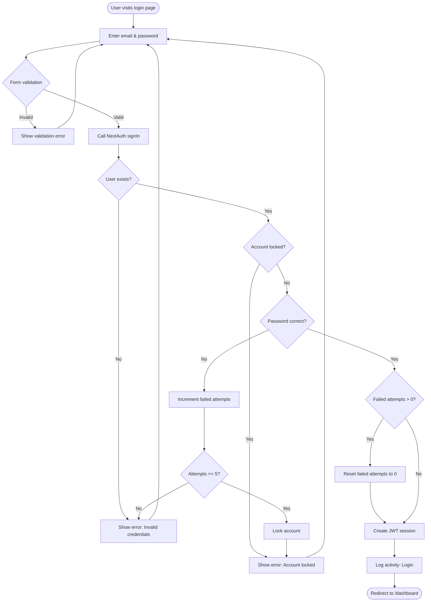
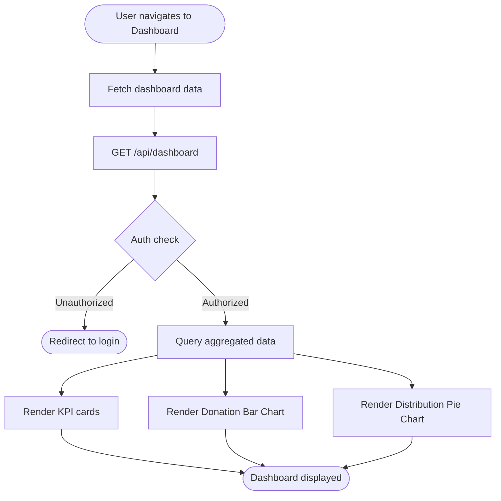
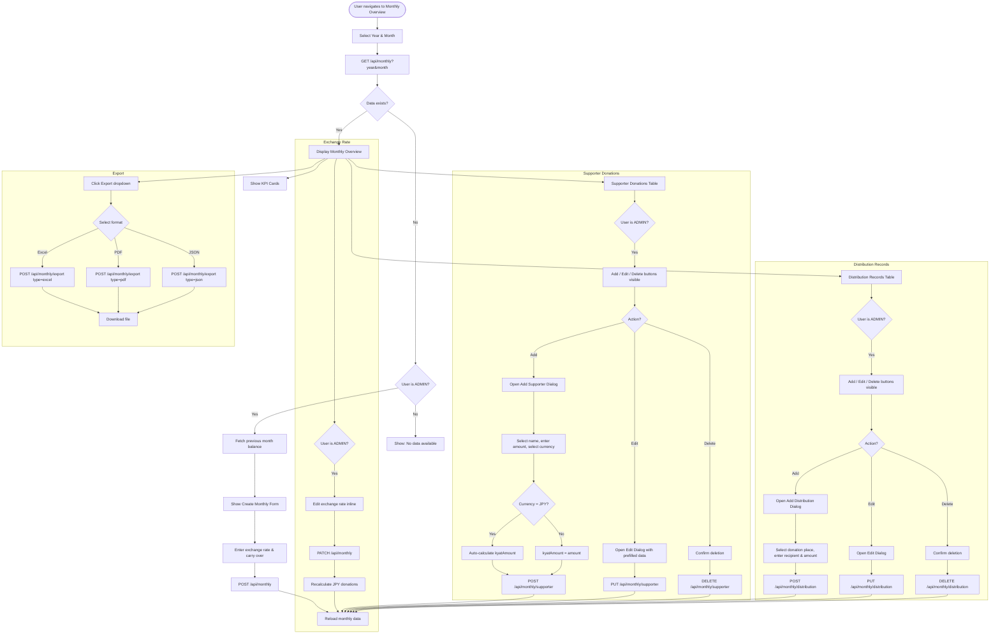
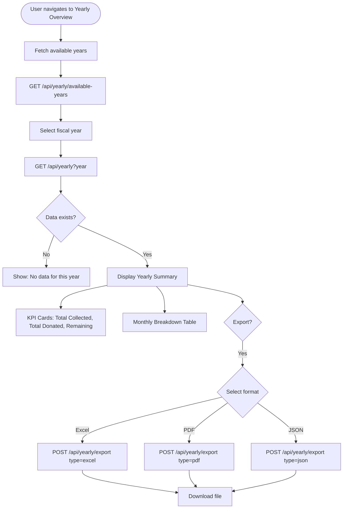
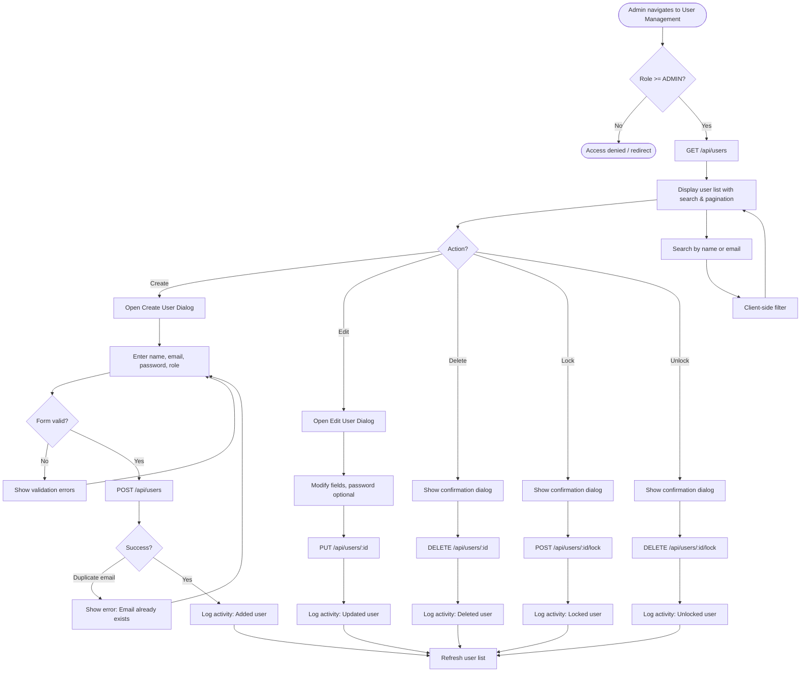
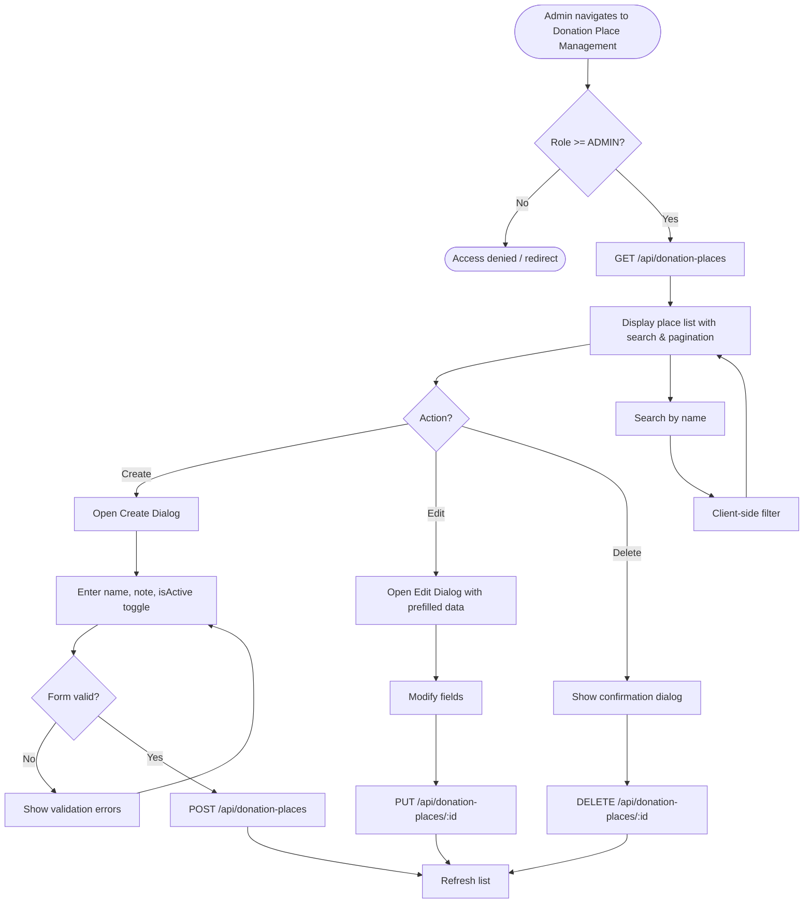
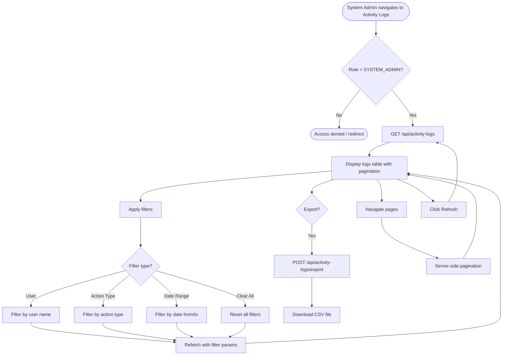
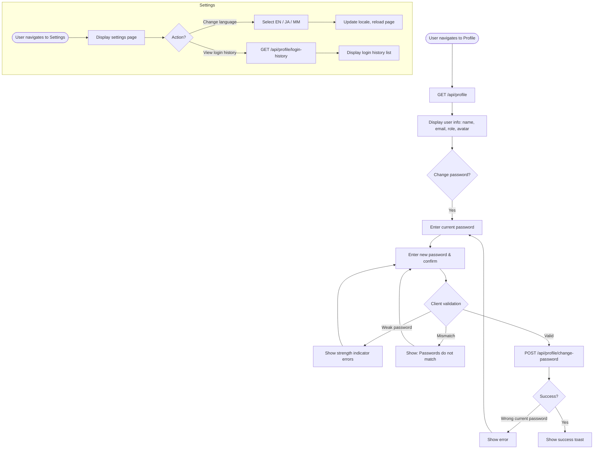

# Spring Liberation Rose — Business Flow Diagrams

## 1. Authentication Flow

## 2. Dashboard Tab

## 3. Monthly Overview Tab

## 4. Yearly Overview Tab

## 5. User Management Tab

## 6. Donation Place Management Tab

## 7. Activity Logs Tab

## 8. Profile & Settings

