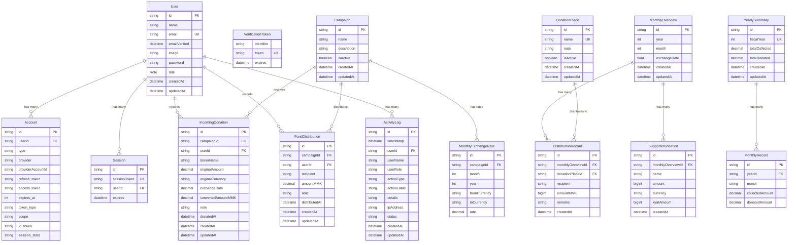

# Spring Liberation Rose Database Schema

```mermaid
erDiagram

    User {
        string id PK
        string name
        string email UK
        datetime emailVerified
        string image
        string password
        Role role
        datetime createdAt
        datetime updatedAt
    }

    Account {
        string id PK
        string userId FK
        string type
        string provider
        string providerAccountId
        string refresh_token
        string access_token
        int expires_at
        string token_type
        string scope
        string id_token
        string session_state
    }

    Session {
        string id PK
        string sessionToken UK
        string userId FK
        datetime expires
    }

    VerificationToken {
        string identifier
        string token UK
        datetime expires
    }

    Campaign {
        string id PK
        string name
        string description
        boolean isActive
        datetime createdAt
        datetime updatedAt
    }

    IncomingDonation {
        string id PK
        string campaignId FK
        string userId FK
        string donorName
        decimal originalAmount
        string originalCurrency
        decimal exchangeRate
        decimal convertedAmountMMK
        string note
        datetime donatedAt
        datetime createdAt
        datetime updatedAt
    }

    FundDistribution {
        string id PK
        string campaignId FK
        string userId FK
        string recipient
        decimal amountMMK
        string note
        datetime distributedAt
        datetime createdAt
        datetime updatedAt
    }

    MonthlyExchangeRate {
        string id PK
        string campaignId FK
        int month
        int year
        string fromCurrency
        string toCurrency
        decimal rate
    }

    DonationPlace {
        string id PK
        string name UK
        string note
        boolean isActive
        datetime createdAt
        datetime updatedAt
    }

    MonthlyOverview {
        string id PK
        int year
        int month
        float exchangeRate
        datetime createdAt
        datetime updatedAt
    }

    SupporterDonation {
        string id PK
        string monthlyOverviewId FK
        string name
        bigint amount
        string currency
        bigint kyatAmount
        datetime createdAt
    }

    DistributionRecord {
        string id PK
        string monthlyOverviewId FK
        string donationPlaceId FK
        string recipient
        bigint amountMMK
        string remarks
        datetime createdAt
    }

    YearlySummary {
        string id PK
        int fiscalYear UK
        decimal totalCollected
        decimal totalDonated
        datetime createdAt
        datetime updatedAt
    }

    MonthlyRecord {
        string id PK
        string yearId FK
        string month
        decimal collectedAmount
        decimal donatedAmount
    }

    %% Auth Relationships
    User ||--o{ Account : "has many"
    User ||--o{ Session : "has many"

    %% Domain Relationships
    User ||--o{ IncomingDonation : "records"
    User ||--o{ FundDistribution : "records"

    Campaign ||--o{ IncomingDonation : "receives"
    Campaign ||--o{ FundDistribution : "distributes"
    Campaign ||--o{ MonthlyExchangeRate : "has rates"

    %% Monthly Overview Relationships
    MonthlyOverview ||--o{ SupporterDonation : "has many"
    MonthlyOverview ||--o{ DistributionRecord : "has many"
    DonationPlace ||--o{ DistributionRecord : "distributes to"

    %% Yearly Summary Relationships
    ActivityLog {
        string id PK
        datetime timestamp
        string userId FK
        string userName
        string userRole
        string actionType
        string actionLabel
        string details
        string ipAddress
        string status
        datetime createdAt
        datetime updatedAt
    }

    %% Activity Log Relationships
    User ||--o{ ActivityLog : "has many"

    YearlySummary ||--o{ MonthlyRecord : "has many"
```
