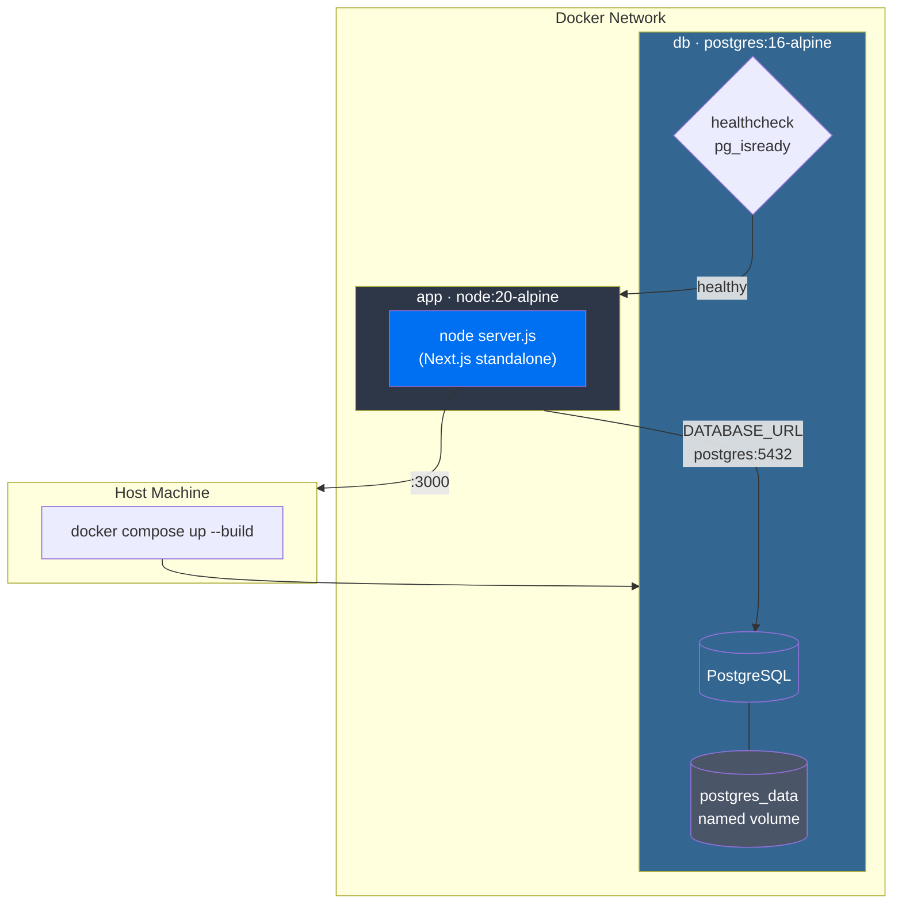

# Docker Workflow (Local Development)

Docker Compose provides a quick way to run the app locally without installing PostgreSQL on your machine.

## Architecture Overview



## Getting Started

### 1. Configure environment

```bash
cp .env.example .env
```

### 2. Start services

```bash
docker compose up --build
```

### 3. Run database migrations

```bash
docker compose exec app npx prisma migrate deploy
```

### 4. Seed admin user and sample data

```bash
docker compose exec app npx tsx prisma/seed.ts
```

### Quick one-liner (all steps)

```bash
docker compose up -d --build && \
docker compose exec app npx prisma migrate deploy && \
docker compose exec app npx tsx prisma/seed.ts
```

Visit [http://localhost:3000](http://localhost:3000)

## Common Commands

| Command | Description |
|---|---|
| `docker compose up --build` | Build and start services |
| `docker compose up -d --build` | Same, but in background |
| `docker compose down` | Stop all services |
| `docker compose down -v` | Stop and **delete database volume** |
| `docker compose logs -f app` | Follow app logs |
| `docker compose logs -f db` | Follow database logs |
| `docker compose exec app sh` | Shell into the app container |
| `docker compose exec db psql -U postgres spring_liberation_rose` | Connect to database |
| `docker compose exec app npx prisma migrate deploy` | Run pending migrations |
| `docker compose exec app npx tsx prisma/seed.ts` | Seed admin user and sample data |

## Environment Variables

All services read from `.env` via `env_file`:

| Variable | Used By | Purpose |
|---|---|---|
| `DATABASE_URL` | app | PostgreSQL connection (must use `db` as host) |
| `POSTGRES_USER` | db | Postgres superuser |
| `POSTGRES_PASSWORD` | db | Postgres password |
| `POSTGRES_DB` | db | Database created on first boot |
| `NEXTAUTH_URL` | app | App base URL |
| `NEXTAUTH_SECRET` | app | Auth signing secret |
| `SMTP_HOST` | app | SMTP server hostname (e.g. `smtp.gmail.com`) |
| `SMTP_PORT` | app | SMTP port (`587` for TLS, `465` for SSL) |
| `SMTP_USER` | app | SMTP authentication username |
| `SMTP_PASS` | app | SMTP authentication password |
| `SMTP_FROM` | app | Sender email address (defaults to `SMTP_USER`) |

## Data Persistence

- Database data is stored in the `postgres_data` named Docker volume
- Data **survives** `docker compose down` (container removal)
- Data is **destroyed** by `docker compose down -v` (volume removal)

## Troubleshooting

| Problem | Solution |
|---|---|
| App won't start | Check `docker compose logs app` |
| `ECONNREFUSED` to database | Ensure `DATABASE_URL` uses `db` not `localhost` |
| Port 5432 already in use | Stop local Postgres or change host port in `docker-compose.yml` |
| Port 3000 already in use | Stop local dev server or change host port in `docker-compose.yml` |
| Stale build cache | Rebuild: `docker compose build --no-cache` |
| Reset everything | `docker compose down -v && docker compose up --build` |
